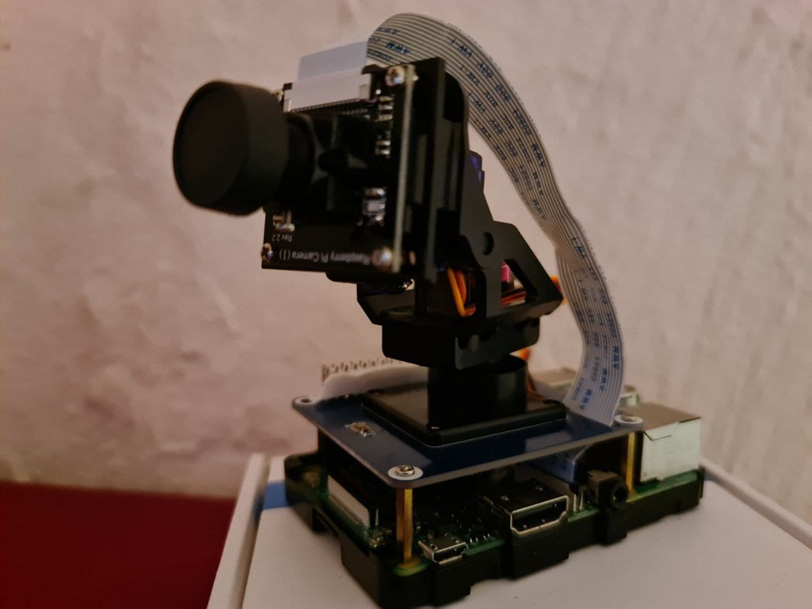

# PI_rover
Controlling Pan-Tilt HAT from a Web app.

## Requirements.

* [Raspberry Pi](https://www.amazon.com/CanaKit-Raspberry-4GB-Starter-Kit/dp/B07V5JTMV9)
* [Raspberry Pi Pan-Tilt HAT](https://www.waveshare.com/product/modules/motors-servos/pan-tilt-hat.htm)
* [Pi Camera](https://www.amazon.com/Raspberry-Pi-Camera-Module-Megapixel/dp/B01ER2SKFS)


<br/>
## Configuration
- docker
- docker-compose
```
git clone https://github.com/AG3NTSN0W/PI_rover.git 

cd PI_rover

# Update rover-ui environment.ts 

docker-compose build

docker-compose up -d

# Rember to update the <URL>
docker run --rm -it --device /dev/video0:/dev/video0  linuxserver/ffmpeg:arm32v7-latest -i /dev/video0 -vf "rotate=180*(PI/180)" -f mpegts -codec:v mpeg1video -s 640x480 -b:v 1000k -bf 0 http://<PI-URL>:8865/secret
```

Open `http://<PI-URL>:4200/`


